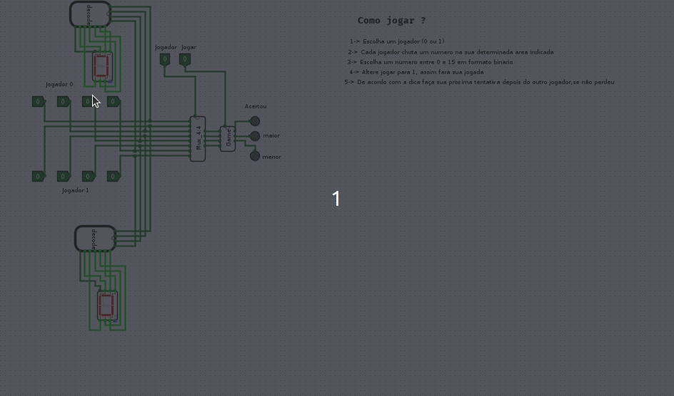
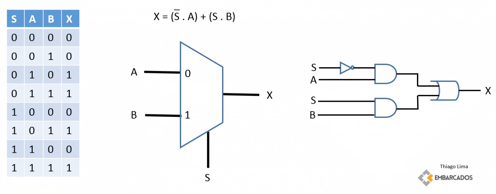
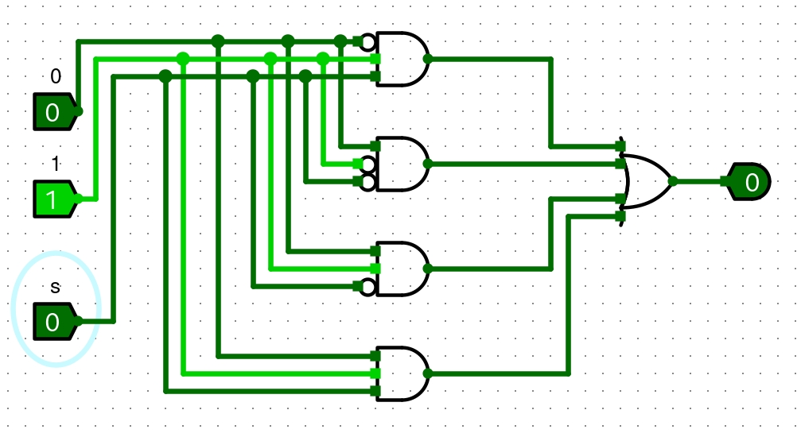
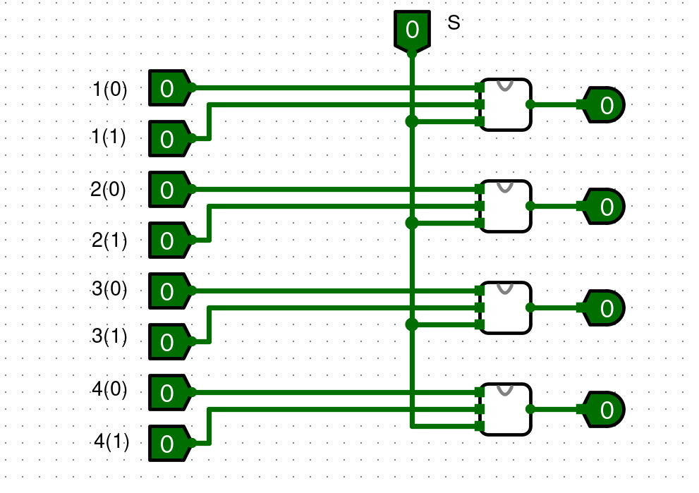
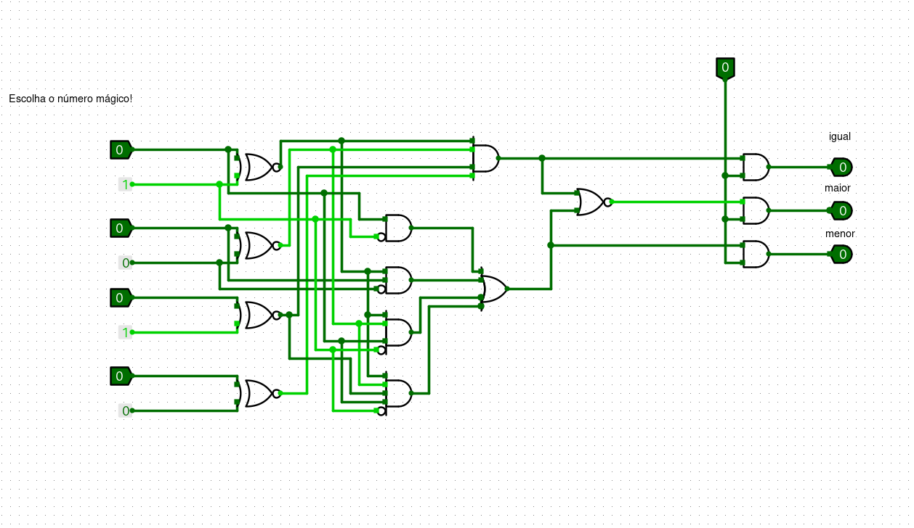
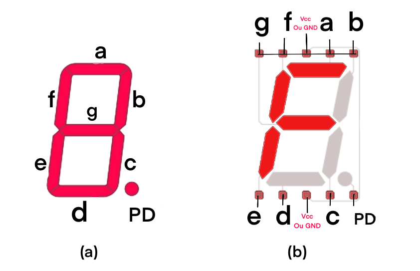
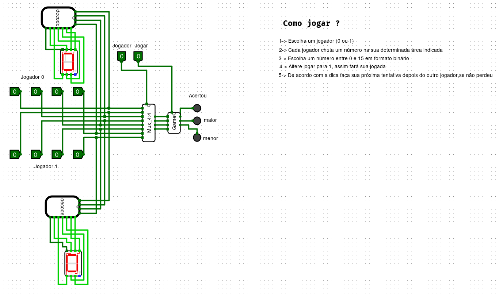

<h1 align="center">
    <p align="center">Projeto circuitos</p>
</h1>
<h2 align="center"/>
    

</h2>

## Indice
- [Sobre](#books-sobre)
- [Ferramentas](#🔨-ferramentas)
- [Clonar](#♻-clonar)
- [Passo a Passo](#passo-a-passo)
- [Multiplexador](#0️⃣1️⃣-multiplexador)
- [Comparador](#🟰➕➖-comparador)
- [Decodificador](#⚙️-decodificador)
- [Conclusão](#✅-conslusão)


##  :books: Sobre
Esse projeto é um jogo criado no **LOGISIM**. O jogo consiste em um circuito que tem a capacidade de receber dois números de 4 bits, cada número é o  palpite de um jogador para acertar um número predefinido. O circuito tem que possibilitar selecionar o jogador, lançar o palpite e retornar se o número chutado é maior, menor ou igual ao definido. O circuito também deverá exibir os números colocados em hexadecimal.

##  Ferramentas

- [Logisim](https://github.com/Logisim-Ita/Logisim)
- [java](https://www.java.com/pt-BR/)

## ♻ Clonar 

```bash
    #Execute
    $ git clone https://github.com/Hide349/Projeto_Circuitos_Digitais.git

```
```bash
    #abrir logisim
    $ java -jar LOGISIM-ITA.jar 
```

## Passo a Passo
**O que fazer?**
<p>Devemos imaginar o nosso projeto como a junção de três grandes peças, o multiplexador, o comparador e o decodificador</p>

### 0️⃣1️⃣ Multiplexador
O **multiplexador** é um circuito que recebe um seletor e n entradas. A saída desse circuito deve ser igual ao valor do seletor na posição n de uma entrada. 


Para cada um na tabela, um and é adcionado no circuito. Se a entrada é 0, ela passa barrada, o contrário passa normal.No final soma tudo com um or.


Para fazer um multiplexador de 4 bits, basta repetir o mux(**nomenclatura do multiplexador**) 4 vezes.



### 🟰➕➖ Comparador
Um **comparador** precisa checar se o número chutado é maior, menor ou igual que o número pré definido. Para fazer isso, primeiro iremos começar checando se os dois números são iguais.

#### 🟰 Iguais
Eles serão iguais quando A3 = B3 e A2 = B2 e A1 = B1 e A0 = B0.
Em circuitos isso ficaria.
- (A3 XNOR B3)
- (A2 XNOR B2)
- (A1 XNOR B1)
- (A0 XNOR B0)

#### ➕ Maior
Um número é maior que o outro desde que. A3>B3 ou A3=B3 e A2>B2 ou A3=B3 e A2=B2, isso até A0 > B0.

- A3>B3 = A3B3'
- A3=B3 e A2>B2=x3A2B2'
- A3=B3 e A2=B2 e A1>B1=
x3x2A1B1'
- A3=B3 e A2=B2 e A1=B1 e A0>B0=x3x2x1A0B0'

#### ➖ Menor
Para um número ser menor que o outro basta apenas que ele não seja nem igual, nem maior.

### 🟰➕➖ Conclusão Comparador
Além disso tudo, é preciso adcionar uma possibilidade de jogar ou não. Para isso basta apenas adcionar um and antes de mostrar o resultado.



### ⚙️ Decodificador
O decodificador utilizará um display de sete segmentos para apresentar os números.



Tomaremos o número 15 como exemplo, de formato binário 1111. Ele é representado pelo F em hexadecimal.Com isso em mente, basta apenas ver quais segmentos devem ser acessos para formar a letra F. Nesse caso os segmentos {a,f,e,g}.

Para montar o decodificador montaremos a tabela verdade, com 4 variáveis e sete saídas. Sendo elas as letras que assumiram valores de 1 ou 0 para cada número.


Nesse caso, a tabela para no 9, mas a lógica continua a mesma só que com os números seguintes sendo representados por letras.

## Casos para cada letra

### A


### B


### C


### D


### E


### F


### G


## ✅ Conslusão
Agora basta apenas juntar todas as peças



## 📄 Considerações finais

Me diverti bastante fazendo o projeto e o documentando também.